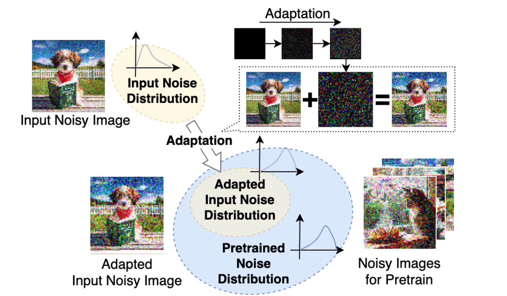
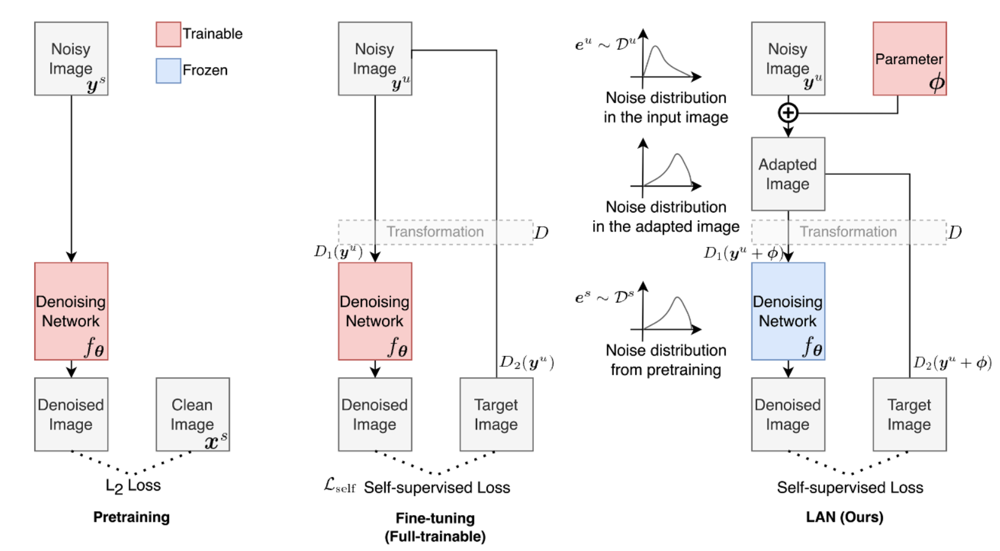

# LAN: Learning to Adapt Noise for Image Denoising论文复现
- 原作者：Changjin Kim, Tae Hyun Kim, Sungyong Baik
- 源码链接：https://github.com/chjinny/LAN
- 论文链接: [[CVPR]](https://openaccess.thecvf.com/content/CVPR2024/html/Kim_LAN_Learning_to_Adapt_Noise_for_Image_Denoising_CVPR_2024_paper.html)


## Table of Contents
- [Overview](#overview)
- [Prepare Model and Dataset](#prepare-model-and-dataset)
- [Adaptation](#adaptation)
- [Citation](#citation)
- [Acknowledgement](#acknowledgement)


## Overview
<p align="center">
  
</p>
<p align="center">
  
</p>

## Prepare Model and Dataset

- 数据集 : 在我的另一个仓库HSI trainset里，下载即可，注意调整文件里的数据集地址。
- Resotmer模型 : 同上
- Uformer模型 ：同上

## Adaptation
```bash
python main.py --model Restormer #选择模型
 --dataset {"poly-U", "Nam",","FIG3"} #选择数据集
 --method {"finetune", "lan"} #选择方法
 --self_loss {zsn2n, nbr2nbr}#选择损失函数
 --num_samples 1 #设定样本数量，默认为全部样本
 --num_GPU 1 #选择使用GPU序号，默认为0
```
## Package

## Citation
```bibtex
@inproceedings{kim2024lan,
  title={LAN: Learning to Adapt Noise for Image Denoising},
  author={Kim, Changjin and Kim, Tae Hyun and Baik, Sungyong},
  booktitle={Proceedings of the IEEE/CVF Conference on Computer Vision and Pattern Recognition},
  pages={25193--25202},
  year={2024}
}
```

## Acknowledgement

The codes are based on follows:
- [Restormer](https://github.com/swz30/Restormer)
- [Neighbor2Neighbor](https://github.com/TaoHuang2018/Neighbor2Neighbor)
- [Zero-Shot Noisr2Noise](https://colab.research.google.com/drive/1i82nyizTdszyHkaHBuKPbWnTzao8HF9b?usp=sharing)

We thank the authors for sharing their codes.
